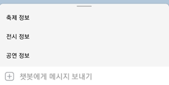

# Travisor

안녕하세요! Travisor는 카카오톡 챗봇을 사용하여 제주도의 축제, 전시, 행사 정보를 제공하고 있습니다.

카카오톡 채널에 "반려톡"을 검색하고 채널 추가를 누르시면 Travisor 서비스를 이용할 수 있습니다.

Travisor를 이용하는 방법

1. 채널을 추가한다.

2. 축제, 전시, 행사 버튼 중 원하는 버튼을 누른다.

3. 날짜 선택 버튼을 클릭한다.

4. 기간을 입력한다.

5. 장소를 입력한다.

6. 행사 정보를 확인한다.

